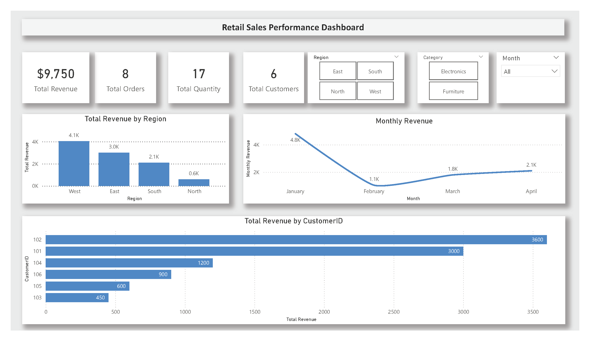

# 🛍️ Retail Sales Analysis — SQL & Power BI Project

## 📌 Project Overview  
This project explores retail sales performance using SQL, supported by a Power BI dashboard that brings the insights to life.  
My goal was to take a simple transactional dataset and turn it into clear, business‑ready analysis — the kind of work you’d expect in a BI or data analyst role.

The project covers:

- Revenue trends  
- Regional performance  
- Customer behavior  
- Product and category insights  
- Ranking and window functions  
- Month‑over‑month patterns  

Everything is structured around real business questions and clean, reusable SQL logic.

---

## 📁 Repository Structure  

---

## 🧾 Dataset Description  
The dataset (`sales.csv`) contains fictional retail transactions with the following fields:

| Column     | Description                     |
|------------|---------------------------------|
| OrderID    | Unique order identifier         |
| OrderDate  | Date of purchase                |
| CustomerID | Unique customer identifier      |
| Region     | Geographic region of the sale   |
| Product    | Product name                    |
| Category   | Product category                |
| Quantity   | Units sold                      |
| UnitPrice  | Price per unit                  |

It’s intentionally simple — the focus is on analysis, not data engineering.

---

## 🧠 SQL Analysis  
Each SQL script answers a specific business question:

### **01 — Total Revenue**  
Overall revenue across all transactions.

### **02 — Revenue by Region**  
Which regions perform best.

### **03 — Revenue by Category**  
Breakdown of revenue by product category.

### **04 — Customer Count**  
Unique customers and repeat buyers.

### **05 — Product Popularity**  
Products ranked by total units sold.

### **06 — Revenue by Product**  
Top‑earning products.

### **07 — Region × Category Revenue**  
A combined view of two dimensions for deeper insight.

---

## 📊 Power BI Dashboard  
To complement the SQL analysis, I built a **Retail Sales Performance Dashboard** in Power BI.

It includes:

- KPI cards (Revenue, Orders, Quantity, Customers)  
- Revenue by Region  
- Monthly Revenue Trend  
- Top Customers  
- Slicers for Region, Category, and Month  

The dashboard is designed to be clean, simple, and executive‑friendly, something you could use in a real business setting.

### 📁 Download the Power BI Dashboard  
You can download and explore the full interactive dashboard here:

👉 [Retail Sales Performance Dashboard (PBIX)](Retail%20Sales%20Performance%20Dashboard.pbix)

---

## 🔍 Key Insights  
A few patterns that typically show up in this dataset:

- Electronics tend to drive the most revenue  
- Certain regions consistently outperform others  
- A small group of customers contributes a large share of revenue  
- Monthly revenue shows clear peaks and dips  
- Product mix analysis highlights opportunities for promotions or bundling  

---

## 🎯 Skills Demonstrated  
- SQL querying and data manipulation  
- Window functions (RANK, running totals)  
- Aggregation and grouping  
- Dimensional analysis (Region × Category)  
- Power BI dashboard design  
- KPI creation and layout design  
- Clear documentation and project structure  

---

## ▶️ How to Use This Project  
1. Download `sales.csv`  
2. Run the SQL scripts in order (01 → 07)  
3. Open the Power BI dashboard to explore the visuals  

---

## 👤 About Me  
I’m Jaime, an Operations & Property Manager transitioning into Business Intelligence.  
I enjoy turning raw data into clear insights and building dashboards that actually help people make decisions. 
SQL and Power BI are my main tools, and this project is part of my growing analytics portfolio.

